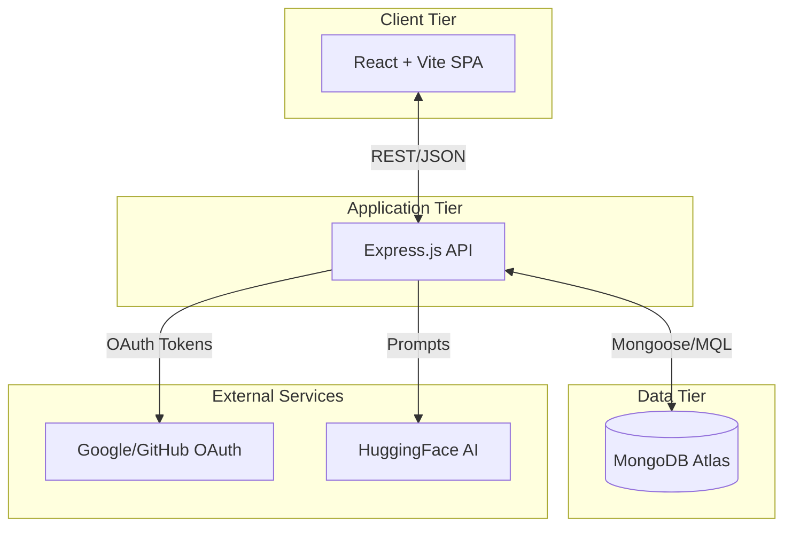
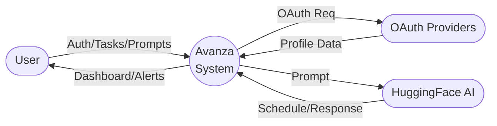
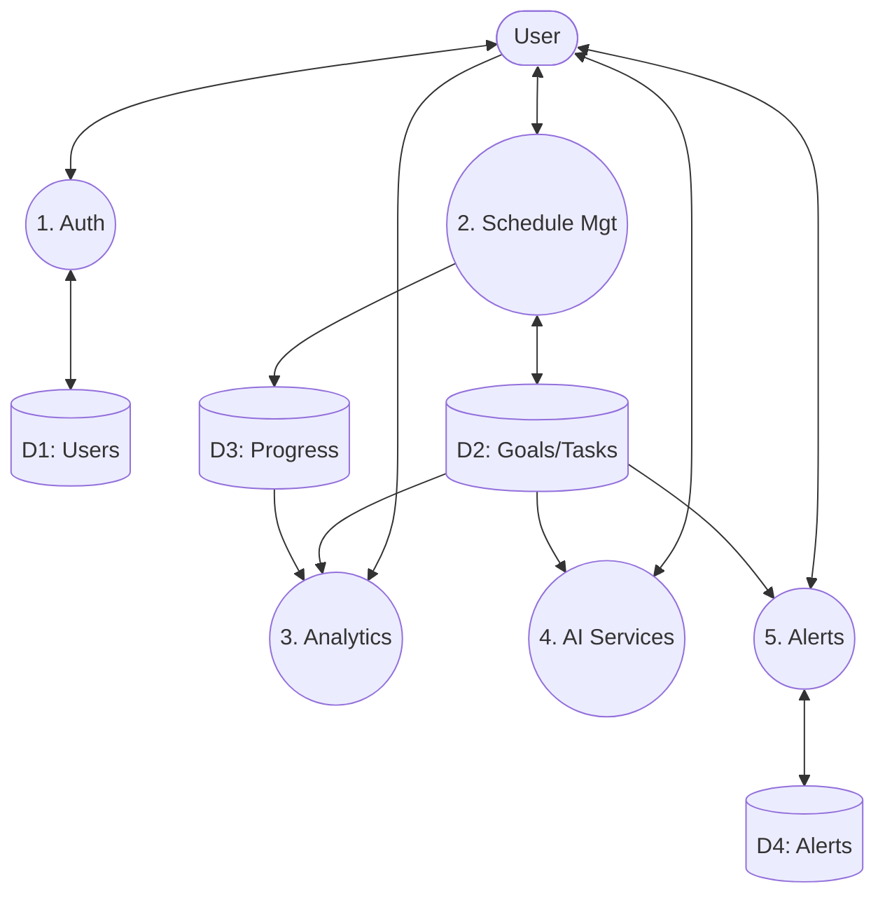

# Project Report: Avanza - Daily Learning Tracker

## 1. Executive Summary
**Avanza** is a full-stack, AI-powered daily learning management system designed to enhance productivity and learning consistency. Built with the MERN stack (React, Node.js, Express, MongoDB), it emphasizes a seamless user experience, intelligent insights, and secure data handling to help users track and achieve their learning objectives.

## 2. Core Features
- **Task & Schedule Management**: Users can create, view, and complete tasks with time-spent tracking. Learning objectives are categorized with priorities and color coding.
- **Analytics & Tracking**: Tracks per-objective completion streaks, weekly progress bar charts, and time summaries.
- **AI Integration**: Generates personalized weekly schedules via HuggingFace LLM and features a context-aware AI chat assistant.
- **Notifications**: Real-time reminders and scheduled automated alerts for pending tasks.
- **Security**: Features robust API security (Helmet, NoSQL injection prevention, XSS sanitization) and OAuth/JWT authentication.

## 3. Technology Stack

| Layer | Technologies | Layer | Technologies |
| :--- | :--- | :--- | :--- |
| **Frontend** | React 18, Vite, Tailwind CSS, Recharts | **AI/External** | HuggingFace Inference SDK, Passport.js |
| **Backend** | Node.js, Express.js, node-cron | **Database** | MongoDB + Mongoose ODM |
| **Security** | helmet, mongo-sanitize, xss-clean, bcrypt | **Auth** | JWT, Google/GitHub OAuth |

## 4. System Architecture
The application uses a standard Client-Server architecture utilizing a modern stack, optimized with Vite for high performance.

## 5. Data Flow Diagrams (DFD)

### 5.1 Context Diagram (Level 0 DFD)

### 5.2 Logical Data Flow (Level 1 DFD)

## 6. Database Schema & Security Overview
- **Collections**: `Users` (profiles/preferences), `LearningObjectives` (goals), `DailyProgress` (logs/streaks), `Schedules` (AI output), `Notifications`, and `Notes`.
- **Security**: Hardened API gateway with `express-mongo-sanitize`, `xss-clean`, robust rate limiting (10 req/15 min on auth), and prompt injection guards.
